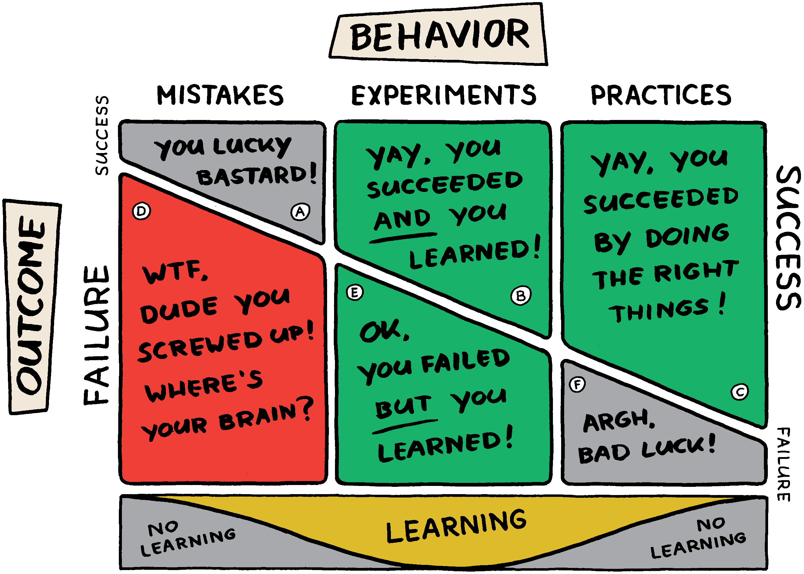

# CelebrationBoard

Based on https://management30.com/product/workouts/celebration-grids/

Tasks up to now
 - [ ] Finish readme
 - [x] General layout
 - [x] Create Back object
 - [ ] Create card + form
 - [ ] Edit card + form (TBD maybe we can defer this one?)
 - [ ] Filter cards
 - [ ] Save + load to json data source 
 - [ ] Map to data source (google sheet?)
